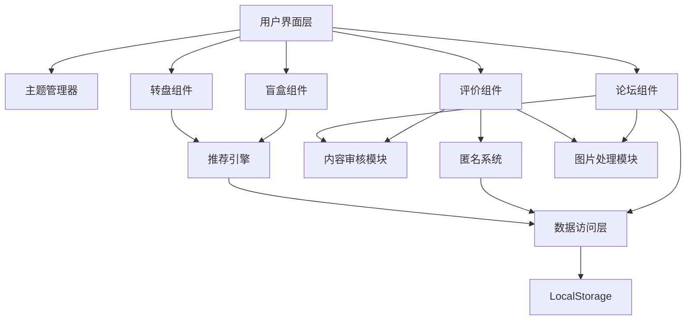

# 技术设计文档：大学城美食地图趣味社区功能

## Overview

本设计文档描述「大学城美食地图」趣味社区功能的技术实现方案。该功能是一个纯前端应用，使用 HTML/CSS/JavaScript 实现，无需后端服务器支持。

### 核心功能模块

1. **趣味性界面系统**：提供可切换的主题和动画效果
2. **互动推荐引擎**：转盘抽奖和盲盒推荐两种趣味推荐方式
3. **匿名评价系统**：基于本地生成的匿名 ID 的餐厅评价机制
4. **社区论坛**：支持发帖、回复、点赞的社区讨论平台
5. **数据持久化层**：基于 LocalStorage 的客户端数据存储

### 技术栈

- **前端框架**：原生 JavaScript (ES6+)
- **样式**：CSS3 with CSS Variables for theming
- **动画**：CSS Animations + Web Animations API
- **存储**：LocalStorage API
- **图片处理**：Canvas API (用于 EXIF 移除)
- **构建工具**：无需构建工具，直接运行

### 设计原则

1. **隐私优先**：所有数据存储在客户端，匿名 ID 不可追溯
2. **轻量级**：无外部依赖，快速加载
3. **响应式**：移动优先设计，适配多种屏幕尺寸
4. **渐进增强**：核心功能在所有现代浏览器中可用

## Architecture

### 系统架构图



### 模块职责

#### 用户界面层 (UI Layer)
- 渲染所有可视组件
- 处理用户交互事件
- 协调各功能模块的展示

#### 主题管理器 (Theme Manager)
- 管理 UI 主题切换（卡通风格、插画风格）
- 应用 CSS 变量更新
- 持久化用户主题偏好

#### 推荐引擎 (Recommendation Engine)
- 根据筛选条件过滤餐厅
- 基于历史偏好计算推荐权重
- 为转盘和盲盒提供餐厅列表

#### 匿名系统 (Anonymous System)
- 生成和管理 Anonymous_ID
- 确保匿名性和一致性
- 防止身份追溯

#### 内容审核模块 (Content Moderation)
- 检测敏感词和联系方式
- 管理举报和隐藏逻辑
- 频率限制控制

#### 图片处理模块 (Image Processing)
- 移除图片 EXIF 数据
- 压缩和优化图片
- 转换为 Base64 存储

#### 数据访问层 (Data Access Layer)
- 封装 LocalStorage 操作
- 提供统一的数据 CRUD 接口
- 管理存储空间

## Components and Interfaces

### 1. Theme Manager

#### 接口定义

```javascript
class ThemeManager {
  constructor() {
    this.currentTheme = 'cartoon'; // 'cartoon' | 'illustration'
    this.loadTheme();
  }
  
  // 切换主题
  switchTheme(themeName) { }
  
  // 应用主题 CSS 变量
  applyTheme(themeName) { }
  
  // 从 LocalStorage 加载主题
  loadTheme() { }
  
  // 保存主题到 LocalStorage
  saveTheme() { }
}
```

#### 主题配置
每个主题定义一组 CSS 变量：
- 主色调、辅助色
- 字体样式
- 圆角、阴影等视觉效果
- 动画时长和缓动函数

### 2. Spin Wheel Component

#### 接口定义

```javascript
class SpinWheel {
  constructor(containerElement, restaurants) {
    this.container = containerElement;
    this.restaurants = restaurants; // 至少 8 个餐厅
    this.isSpinning = false;
    this.selectedRestaurant = null;
  }
  
  // 渲染转盘
  render() { }
  
  // 开始旋转动画
  spin() { }
  
  // 停止并选中餐厅
  stopAt(restaurantIndex) { }
  
  // 显示餐厅详情卡片
  showRestaurantDetail(restaurant) { }
  
  // 重新旋转
  respin() { }
}
```

#### 动画实现
- 使用 CSS `transform: rotate()` 实现旋转
- 旋转时长：2-4 秒（随机）
- 缓动函数：cubic-bezier(0.25, 0.1, 0.25, 1) 模拟减速
- 最终角度计算：确保指针指向选中餐厅

### 3. Mystery Box Component

#### 接口定义

```javascript
class MysteryBox {
  constructor(containerElement, restaurants) {
    this.container = containerElement;
    this.restaurants = restaurants; // 至少 6 个餐厅
    this.dailyLimit = 3;
    this.openedToday = 0;
    this.boxes = [];
  }
  
  // 渲染盲盒网格
  render() { }
  
  // 打开盲盒动画
  openBox(boxIndex) { }
  
  // 揭示餐厅
  revealRestaurant(restaurant) { }
  
  // 检查每日限制
  checkDailyLimit() { }
  
  // 重置盲盒
  reset() { }
}
```

#### 动画实现
- 盲盒翻转效果：CSS 3D transform
- 开启动画：scale + rotate + opacity 组合
- 揭示效果：从模糊到清晰的渐变

### 4. Recommendation Engine

#### 接口定义

```javascript
class RecommendationEngine {
  constructor(allRestaurants) {
    this.allRestaurants = allRestaurants;
    this.filters = {
      priceRange: null,    // '0-10' | '10-20' | '20+'
      distance: null,      // '500m' | '1km' | '2km'
      cuisine: null,       // '中餐' | '西餐' | '日韩料理' 等
      minRating: null      // 最低评分
    };
    this.userHistory = [];
  }
  
  // 设置筛选条件
  setFilters(filters) { }
  
  // 获取符合条件的餐厅
  getFilteredRestaurants() { }
  
  // 基于历史偏好计算权重
  calculateWeights(restaurants) { }
  
  // 为转盘选择餐厅（至少 8 个）
  selectForSpinWheel(count = 8) { }
  
  // 为盲盒选择餐厅（至少 6 个）
  selectForMysteryBox(count = 6) { }
  
  // 记录用户选择
  recordChoice(restaurant) { }
}
```

#### 推荐算法逻辑

1. **筛选阶段**：
   - 应用价格、距离、菜系、评分过滤器
   - 返回符合所有条件的餐厅列表

2. **权重计算**：
   - 基础权重：所有餐厅初始权重为 1
   - 历史偏好加权：用户历史选择的菜系 +0.5 权重
   - 评分加权：评分每高 0.5 星 +0.2 权重
   - 距离加权：距离每近 500m +0.1 权重

3. **随机选择**：
   - 使用加权随机算法选择餐厅
   - 确保不重复选择

### 5. Anonymous System

#### 接口定义

```javascript
class AnonymousSystem {
  constructor() {
    this.anonymousId = null;
    this.init();
  }
  
  // 初始化匿名 ID
  init() { }
  
  // 生成匿名 ID
  generateAnonymousId() { }
  
  // 获取当前匿名 ID
  getAnonymousId() { }
  
  // 验证匿名 ID 格式
  validateAnonymousId(id) { }
}
```

#### 匿名 ID 生成机制

**生成算法**：
```javascript
function generateAnonymousId() {
  const timestamp = Date.now();
  const random = Math.random().toString(36).substring(2, 15);
  const hash = simpleHash(timestamp + random);
  return `anon_${hash}`;
}

function simpleHash(str) {
  let hash = 0;
  for (let i = 0; i < str.length; i++) {
    const char = str.charCodeAt(i);
    hash = ((hash << 5) - hash) + char;
    hash = hash & hash; // Convert to 32bit integer
  }
  return Math.abs(hash).toString(36);
}
```

**特性**：
- 格式：`anon_` + 哈希值（如 `anon_k3j9x2m1p`）
- 唯一性：基于时间戳和随机数
- 不可追溯：无法反向推导生成时间或设备信息
- 持久性：存储在 LocalStorage，清除浏览器数据后重新生成

**存储位置**：
- Key: `user_anonymous_id`
- Value: 生成的匿名 ID 字符串

### 6. Review System

#### 接口定义

```javascript
class ReviewSystem {
  constructor(anonymousSystem) {
    this.anonymousSystem = anonymousSystem;
  }
  
  // 提交评价
  submitReview(restaurantId, rating, content, images) { }
  
  // 获取餐厅的所有评价
  getReviews(restaurantId, sortBy = 'time') { }
  
  // 编辑评价（仅允许一次）
  editReview(reviewId, newContent) { }
  
  // 检查用户是否已评价过该餐厅（本月）
  hasReviewedThisMonth(restaurantId) { }
  
  // 计算餐厅平均评分
  calculateAverageRating(restaurantId) { }
  
  // 检测异常评价模式
  detectAnomalousPattern(restaurantId) { }
}
```

#### 评价限制机制

- **频率限制**：每个用户每月对同一餐厅只能评价一次
- **编辑限制**：评价提交后只能编辑一次，不能删除
- **检测逻辑**：
  - 短时间内（24小时）超过 10 条 5 星评价 → 标记为可疑
  - 同一匿名 ID 短时间内多次评价不同餐厅 → 标记为可疑

### 7. Community Forum

#### 接口定义

```javascript
class CommunityForum {
  constructor(anonymousSystem, contentModeration) {
    this.anonymousSystem = anonymousSystem;
    this.contentModeration = contentModeration;
  }
  
  // 创建帖子
  createPost(title, content, images, tags) { }
  
  // 获取所有帖子
  getPosts(sortBy = 'time', filterTag = null) { }
  
  // 添加回复
  addReply(postId, content) { }
  
  // 获取帖子的回复
  getReplies(postId) { }
  
  // 点赞帖子或回复
  like(targetId, targetType) { }
  
  // 取消点赞
  unlike(targetId, targetType) { }
  
  // 举报内容
  reportContent(contentId, reason) { }
  
  // 检查发布频率限制
  checkPostLimit() { }
  checkReplyLimit() { }
}
```

#### 频率限制

- **发帖限制**：每个用户每天最多 10 条帖子
- **回复限制**：每个用户每分钟最多 5 条回复
- **实现方式**：
  - 在 LocalStorage 中记录时间戳数组
  - 检查时过滤掉过期的时间戳
  - 判断剩余数量是否超过限制

### 8. Content Moderation

#### 接口定义

```javascript
class ContentModeration {
  constructor() {
    this.sensitiveWords = [...]; // 敏感词列表
    this.contactPatterns = [
      /\d{11}/,           // 手机号
      /\d{5,}/,           // QQ号
      /微信[:：]?\s*\w+/,  // 微信号
    ];
  }
  
  // 检测敏感词
  detectSensitiveWords(text) { }
  
  // 检测联系方式
  detectContactInfo(text) { }
  
  // 综合审核
  moderate(content) { }
  
  // 处理举报
  handleReport(contentId, reportCount) { }
}
```

#### 审核规则

1. **联系方式检测**：
   - 11 位连续数字 → 拦截
   - 包含"微信"+"字母数字组合" → 拦截
   - 5 位以上连续数字 → 警告

2. **敏感词检测**：
   - 维护敏感词列表
   - 使用字符串匹配检测
   - 检测到敏感词 → 标记内容

3. **举报处理**：
   - 单条内容被举报 3 次 → 自动隐藏
   - 隐藏的内容标记为"待审核"状态

### 9. Image Processing

#### 接口定义

```javascript
class ImageProcessor {
  // 处理图片：移除 EXIF，压缩，转 Base64
  processImage(file, maxWidth = 1200, quality = 0.8) { }
  
  // 移除 EXIF 数据
  removeExif(imageFile) { }
  
  // 压缩图片
  compressImage(imageData, maxWidth, quality) { }
  
  // 转换为 Base64
  toBase64(canvas) { }
}
```

#### 图片处理流程

1. **读取文件**：使用 FileReader API 读取用户上传的图片
2. **加载到 Canvas**：创建 Image 对象并绘制到 Canvas
3. **移除 EXIF**：Canvas 重绘自动移除 EXIF 数据
4. **压缩**：
   - 计算缩放比例（保持宽度不超过 1200px）
   - 使用 `canvas.toDataURL('image/jpeg', quality)` 压缩
5. **存储**：将 Base64 字符串存储到 LocalStorage

### 10. Data Access Layer

#### 接口定义

```javascript
class DataAccessLayer {
  constructor() {
    this.storageKeys = {
      ANONYMOUS_ID: 'user_anonymous_id',
      THEME: 'user_theme',
      FILTERS: 'user_filters',
      HISTORY: 'user_history',
      POSTS: 'community_posts',
      REPLIES: 'community_replies',
      REVIEWS: 'restaurant_reviews',
      LIKES: 'user_likes',
      REPORTS: 'content_reports',
      POST_TIMESTAMPS: 'post_timestamps',
      REPLY_TIMESTAMPS: 'reply_timestamps',
      MYSTERY_BOX_DATE: 'mystery_box_date',
      MYSTERY_BOX_COUNT: 'mystery_box_count',
    };
  }
  
  // 通用存储方法
  set(key, value) { }
  get(key) { }
  remove(key) { }
  clear() { }
  
  // 检查存储空间
  checkStorageSpace() { }
  
  // 获取存储使用情况
  getStorageUsage() { }
}
```

#### 存储空间管理

- **LocalStorage 限制**：通常为 5-10MB
- **监控策略**：
  - 每次写入前检查剩余空间
  - 当使用超过 80% 时警告用户
  - 提供清理建议（如删除旧帖子、压缩图片）

## Data Models

### 1. Restaurant（餐厅）

```javascript
{
  id: string,              // 唯一标识符
  name: string,            // 餐厅名称
  cuisine: string,         // 菜系类型
  priceRange: string,      // 价格区间 '0-10' | '10-20' | '20+'
  distance: number,        // 距离（米）
  location: {
    lat: number,
    lng: number
  },
  rating: number,          // 平均评分 (0-5)
  reviewCount: number,     // 评价数量
  tags: string[],          // 特色标签
  images: string[],        // 餐厅图片 URLs
  description: string      // 简介
}
```

### 2. Review（评价）

```javascript
{
  id: string,              // 唯一标识符
  restaurantId: string,    // 关联的餐厅 ID
  anonymousId: string,     // 评价者的匿名 ID
  rating: number,          // 评分 (1-5)
  content: string,         // 评价内容
  images: string[],        // 图片 Base64 数组（最多 3 张）
  timestamp: number,       // 提交时间戳
  editedTimestamp: number | null,  // 编辑时间戳
  hasEdited: boolean,      // 是否已编辑过
  likes: number,           // 点赞数
  isSuspicious: boolean    // 是否被标记为可疑
}
```

### 3. Post（帖子）

```javascript
{
  id: string,              // 唯一标识符
  anonymousId: string,     // 发帖者的匿名 ID
  title: string,           // 标题
  content: string,         // 内容
  images: string[],        // 图片 Base64 数组（最多 5 张）
  tags: string[],          // 话题标签（最多 5 个）
  timestamp: number,       // 发布时间戳
  replyCount: number,      // 回复数量
  likes: number,           // 点赞数
  isHidden: boolean,       // 是否被隐藏
  reportCount: number,     // 被举报次数
  hasNewReply: boolean     // 是否有新回复（用于标识）
}
```

### 4. Reply（回复）

```javascript
{
  id: string,              // 唯一标识符
  postId: string,          // 关联的帖子 ID
  anonymousId: string,     // 回复者的匿名 ID
  content: string,         // 回复内容
  timestamp: number,       // 回复时间戳
  likes: number,           // 点赞数
  isHidden: boolean,       // 是否被隐藏
  reportCount: number      // 被举报次数
}
```

### 5. Like（点赞记录）

```javascript
{
  anonymousId: string,     // 点赞者的匿名 ID
  targetId: string,        // 被点赞对象的 ID
  targetType: string,      // 类型：'post' | 'reply' | 'review'
  timestamp: number        // 点赞时间戳
}
```

### 6. UserPreferences（用户偏好）

```javascript
{
  theme: string,           // 主题：'cartoon' | 'illustration'
  filters: {
    priceRange: string | null,
    distance: string | null,
    cuisine: string | null,
    minRating: number | null
  },
  history: {
    restaurantId: string,
    timestamp: number,
    source: string         // 'spin_wheel' | 'mystery_box'
  }[]
}
```

### 7. MysteryBoxState（盲盒状态）

```javascript
{
  date: string,            // 日期 (YYYY-MM-DD)
  openedCount: number,     // 今日已开启次数
  openedBoxes: number[]    // 已开启的盲盒索引
}
```

### 8. RateLimitRecord（频率限制记录）

```javascript
{
  anonymousId: string,
  postTimestamps: number[],    // 发帖时间戳数组
  replyTimestamps: number[]    // 回复时间戳数组
}
```

### 9. Report（举报记录）

```javascript
{
  id: string,              // 唯一标识符
  contentId: string,       // 被举报内容的 ID
  contentType: string,     // 类型：'post' | 'reply' | 'review'
  reporterId: string,      // 举报者匿名 ID
  reason: string,          // 举报原因
  timestamp: number        // 举报时间戳
}
```


## Correctness Properties

*属性（Property）是一个在系统所有有效执行中都应该成立的特征或行为——本质上是关于系统应该做什么的形式化陈述。属性是人类可读规范和机器可验证正确性保证之间的桥梁。*

### Property Reflection（属性反思）

在将验收标准转换为属性之前，我识别了以下冗余并进行了合并：

1. **存储相关属性合并**：
   - 8.1（存储匿名 ID）和 11.1（使用 LocalStorage 存储匿名 ID）是重复的 → 合并为一个属性
   - 11.2、11.3、11.4 都是关于数据持久化和恢复 → 合并为往返属性

2. **筛选功能合并**：
   - 9.1-9.4（按价格、距离、菜系、评分筛选）和 9.5（组合筛选）→ 合并为一个综合筛选属性
   - 2.4（转盘筛选）也验证相同的筛选逻辑 → 包含在综合筛选属性中

3. **点赞功能合并**：
   - 5.3（允许点赞）和 5.4（更新点赞数）→ 合并为点赞增加属性
   - 5.5（点赞去重）保持独立，因为它测试不同的约束

4. **排序功能合并**：
   - 4.2（帖子按时间排序）和 7.6（评价按时间/点赞排序）→ 保持独立，因为它们应用于不同的数据类型

5. **频率限制合并**：
   - 10.5（每日发帖限制）和 10.6（每分钟回复限制）→ 保持独立，因为它们是不同的时间窗口

6. **响应式布局**：
   - 12.1-12.3（不同设备的布局）→ 这些是具体示例，保持为 example 测试

### 核心属性

### Property 1: 匿名 ID 唯一性和持久性

*对于任意*用户会话，系统生成的匿名 ID 应该是唯一的，并且在存储到 LocalStorage 后能够被读取并保持一致。

**Validates: Requirements 6.1, 8.1, 11.1**

### Property 2: 匿名 ID 跨餐厅一致性

*对于任意*用户在不同餐厅提交的多个评价，所有评价应该使用相同的匿名 ID。

**Validates: Requirements 6.6**

### Property 3: 转盘餐厅数量

*对于任意*符合筛选条件的餐厅列表（数量 ≥ 8），转盘应该显示至少 8 个餐厅选项。

**Validates: Requirements 2.1**

### Property 4: 转盘旋转时长

*对于任意*转盘旋转操作，动画持续时间应该在 2 到 4 秒之间。

**Validates: Requirements 2.2**

### Property 5: 转盘选中结果

*对于任意*转盘旋转操作，停止后应该有且仅有一个餐厅被选中并高亮显示。

**Validates: Requirements 2.3**

### Property 6: 转盘详情显示

*对于任意*转盘选中的餐厅，应用应该显示包含该餐厅完整信息的详情卡片。

**Validates: Requirements 2.5**

### Property 7: 盲盒数量

*对于任意*符合筛选条件的餐厅列表（数量 ≥ 6），盲盒应该显示至少 6 个未开启的盲盒选项。

**Validates: Requirements 3.1**

### Property 8: 盲盒揭示餐厅

*对于任意*盲盒开启操作，应该返回一个有效的餐厅对象，包含餐厅信息和特色标签。

**Validates: Requirements 3.3**

### Property 9: 盲盒每日限制

*对于任意*用户在同一天内的盲盒开启操作，当开启次数达到 3 次后，后续开启请求应该被拒绝，直到日期变更后重置。

**Validates: Requirements 3.4**

### Property 10: 推荐权重偏好调整

*对于任意*有历史选择记录的用户，推荐引擎返回的餐厅列表中，用户偏好菜系的餐厅应该有更高的出现概率。

**Validates: Requirements 3.5, 9.6**

### Property 11: 综合筛选条件

*对于任意*筛选条件组合（价格区间、距离、菜系、最低评分），推荐引擎返回的所有餐厅应该同时满足所有设置的筛选条件。

**Validates: Requirements 2.4, 9.1, 9.2, 9.3, 9.4, 9.5**

### Property 12: 帖子创建

*对于任意*包含有效标题和内容的帖子数据，社区论坛应该能够成功创建帖子并返回帖子 ID。

**Validates: Requirements 4.1**

### Property 13: 帖子时间倒序排列

*对于任意*帖子列表，按时间排序后，任意相邻的两个帖子，前一个的时间戳应该大于或等于后一个的时间戳。

**Validates: Requirements 4.2**

### Property 14: 帖子必填字段验证

*对于任意*缺少标题或内容的帖子提交请求，应该被拒绝并返回错误信息。

**Validates: Requirements 4.3**

### Property 15: 帖子图片数量限制

*对于任意*包含超过 5 张图片的帖子提交请求，应该被拒绝或自动截断为前 5 张图片。

**Validates: Requirements 4.4**

### Property 16: 标签筛选

*对于任意*话题标签，按该标签筛选返回的所有帖子都应该包含该标签。

**Validates: Requirements 4.5**

### Property 17: 帖子信息完整性

*对于任意*帖子，其渲染结果应该包含发布时间和回复数量信息。

**Validates: Requirements 4.6**

### Property 18: 回复显示

*对于任意*帖子 ID，获取回复应该返回该帖子的所有回复记录。

**Validates: Requirements 5.1**

### Property 19: 回复创建

*对于任意*有效的回复内容和帖子 ID，应该能够成功添加回复并更新帖子的回复计数。

**Validates: Requirements 5.2**

### Property 20: 点赞增加

*对于任意*帖子或回复，当用户点赞后，其点赞数量应该增加 1。

**Validates: Requirements 5.3, 5.4**

### Property 21: 点赞去重

*对于任意*内容（帖子或回复），同一匿名 ID 多次点赞应该只计数一次，点赞数量不应该重复增加。

**Validates: Requirements 5.5**

### Property 22: 新回复标识

*对于任意*收到新回复的帖子，在帖子列表中应该显示"新回复"标识或标记。

**Validates: Requirements 5.6**

### Property 23: 评价匿名性

*对于任意*提交的评价，其显示信息应该只包含匿名 ID，不应该包含任何真实身份信息（如姓名、联系方式）。

**Validates: Requirements 6.2**

### Property 24: 评分范围验证

*对于任意*评分值，如果不在 1 到 5 的范围内，评价提交应该被拒绝。

**Validates: Requirements 6.3**

### Property 25: 评价图片数量限制

*对于任意*包含超过 3 张图片的评价提交请求，应该被拒绝或自动截断为前 3 张图片。

**Validates: Requirements 6.5**

### Property 26: 每月评价频率限制

*对于任意*餐厅和用户，如果该用户在当前月份已经评价过该餐厅，再次评价请求应该被拒绝。

**Validates: Requirements 7.1**

### Property 27: 评价编辑限制

*对于任意*已提交的评价，应该不能被删除，且只能编辑一次，第二次编辑请求应该被拒绝。

**Validates: Requirements 7.2**

### Property 28: 平均评分计算

*对于任意*餐厅的评价列表，计算的平均评分应该等于所有评分之和除以评价数量。

**Validates: Requirements 7.3**

### Property 29: 评价时间统计

*对于任意*时间范围和餐厅，统计的评价数量应该等于该时间范围内该餐厅的评价记录数。

**Validates: Requirements 7.4**

### Property 30: 异常评价模式检测

*对于任意*餐厅，如果在 24 小时内收到超过 10 条 5 星评价，应该被标记为可疑模式。

**Validates: Requirements 7.5**

### Property 31: 评价排序

*对于任意*评价列表，按时间倒序排序后，相邻评价的时间戳应该递减；按点赞数排序后，相邻评价的点赞数应该递减。

**Validates: Requirements 7.6**

### Property 32: EXIF 数据移除

*对于任意*包含 EXIF 地理位置信息的图片，经过处理后的图片应该不包含 EXIF 数据。

**Validates: Requirements 8.4**

### Property 33: 联系方式检测

*对于任意*包含手机号（11 位连续数字）或微信号模式的文本，内容审核应该检测并拦截该内容。

**Validates: Requirements 10.1**

### Property 34: 敏感词检测

*对于任意*包含敏感词列表中词汇的文本，内容审核应该检测并标记该内容。

**Validates: Requirements 10.2**

### Property 35: 举报阈值隐藏

*对于任意*内容，当被举报次数达到 3 次时，该内容应该被自动隐藏并标记为待审核状态。

**Validates: Requirements 10.4**

### Property 36: 每日发帖限制

*对于任意*用户，当其在当天发布的帖子数量达到 10 条后，后续发帖请求应该被拒绝。

**Validates: Requirements 10.5**

### Property 37: 每分钟回复限制

*对于任意*用户，当其在最近一分钟内发布的回复数量达到 5 条后，后续回复请求应该被拒绝。

**Validates: Requirements 10.6**

### Property 38: 数据持久化往返

*对于任意*用户数据（筛选偏好、帖子、评价、回复），存储到 LocalStorage 后重新加载，应该能够恢复相同的数据内容。

**Validates: Requirements 11.2, 11.3, 11.4**

### Property 39: 存储空间警告

*对于任意*应用状态，当 LocalStorage 使用率超过 80% 时，应该触发警告提示用户。

**Validates: Requirements 11.6**

### Property 40: 转盘尺寸自适应

*对于任意*屏幕宽度，转盘的直径应该根据屏幕尺寸按比例调整，确保在视口内完整显示。

**Validates: Requirements 12.4**

### Property 41: 交互元素最小尺寸

*对于任意*交互元素（按钮、链接等），其点击区域的宽度和高度都应该不小于 44 像素。

**Validates: Requirements 12.5**


## Error Handling

### 1. LocalStorage 错误处理

#### 存储空间不足
```javascript
try {
  localStorage.setItem(key, value);
} catch (e) {
  if (e.name === 'QuotaExceededError') {
    // 显示友好提示
    showStorageFullWarning();
    // 提供清理选项
    offerDataCleanup();
  }
}
```

**处理策略**：
- 检测 QuotaExceededError 异常
- 提示用户存储空间已满
- 提供清理建议：删除旧帖子、清除缓存图片
- 允许用户选择性删除数据

#### LocalStorage 不可用
```javascript
function isLocalStorageAvailable() {
  try {
    const test = '__storage_test__';
    localStorage.setItem(test, test);
    localStorage.removeItem(test);
    return true;
  } catch (e) {
    return false;
  }
}
```

**处理策略**：
- 应用启动时检测 LocalStorage 可用性
- 如果不可用，显示警告并降级为内存存储
- 提示用户数据不会持久化

### 2. 图片处理错误

#### 图片加载失败
```javascript
function loadImage(file) {
  return new Promise((resolve, reject) => {
    const reader = new FileReader();
    reader.onload = (e) => {
      const img = new Image();
      img.onload = () => resolve(img);
      img.onerror = () => reject(new Error('图片加载失败'));
      img.src = e.target.result;
    };
    reader.onerror = () => reject(new Error('文件读取失败'));
    reader.readAsDataURL(file);
  });
}
```

**处理策略**：
- 捕获 FileReader 和 Image 加载错误
- 显示友好错误消息
- 允许用户重新选择图片

#### 图片格式不支持
```javascript
const SUPPORTED_FORMATS = ['image/jpeg', 'image/png', 'image/gif', 'image/webp'];

function validateImageFormat(file) {
  if (!SUPPORTED_FORMATS.includes(file.type)) {
    throw new Error(`不支持的图片格式: ${file.type}`);
  }
}
```

**处理策略**：
- 验证文件 MIME 类型
- 拒绝不支持的格式
- 提示用户支持的格式列表

#### 图片过大
```javascript
const MAX_FILE_SIZE = 5 * 1024 * 1024; // 5MB

function validateImageSize(file) {
  if (file.size > MAX_FILE_SIZE) {
    throw new Error('图片大小超过 5MB 限制');
  }
}
```

**处理策略**：
- 检查文件大小
- 拒绝过大的文件
- 建议用户压缩图片

### 3. 数据验证错误

#### 输入验证失败
```javascript
class ValidationError extends Error {
  constructor(field, message) {
    super(message);
    this.name = 'ValidationError';
    this.field = field;
  }
}

function validatePost(post) {
  if (!post.title || post.title.trim() === '') {
    throw new ValidationError('title', '标题不能为空');
  }
  if (!post.content || post.content.trim() === '') {
    throw new ValidationError('content', '内容不能为空');
  }
  if (post.images && post.images.length > 5) {
    throw new ValidationError('images', '图片数量不能超过 5 张');
  }
}
```

**处理策略**：
- 在提交前验证所有必填字段
- 显示具体的字段错误信息
- 高亮显示错误字段
- 保留用户已输入的内容

#### 频率限制错误
```javascript
class RateLimitError extends Error {
  constructor(limitType, resetTime) {
    super(`操作过于频繁，请稍后再试`);
    this.name = 'RateLimitError';
    this.limitType = limitType;
    this.resetTime = resetTime;
  }
}
```

**处理策略**：
- 显示剩余时间或次数
- 提供友好的等待提示
- 禁用提交按钮直到限制解除

### 4. 内容审核错误

#### 敏感内容拦截
```javascript
class ContentModerationError extends Error {
  constructor(reason, details) {
    super('内容包含不允许的信息');
    this.name = 'ContentModerationError';
    this.reason = reason;
    this.details = details;
  }
}
```

**处理策略**：
- 明确告知用户内容被拦截的原因
- 不显示具体的敏感词（避免规避）
- 允许用户修改后重新提交

### 5. 动画和 UI 错误

#### 动画中断处理
```javascript
class SpinWheel {
  spin() {
    if (this.isSpinning) {
      throw new Error('转盘正在旋转中');
    }
    this.isSpinning = true;
    // 执行动画
    this.animation = this.element.animate(/* ... */);
    this.animation.onfinish = () => {
      this.isSpinning = false;
    };
  }
  
  cancel() {
    if (this.animation) {
      this.animation.cancel();
      this.isSpinning = false;
    }
  }
}
```

**处理策略**：
- 防止重复触发动画
- 提供取消机制
- 确保状态正确重置

### 6. 数据不一致错误

#### 引用完整性
```javascript
function getPost(postId) {
  const post = dataLayer.get(`post_${postId}`);
  if (!post) {
    throw new Error(`帖子不存在: ${postId}`);
  }
  return post;
}

function addReply(postId, content) {
  const post = getPost(postId); // 验证帖子存在
  const reply = createReply(postId, content);
  post.replyCount++;
  dataLayer.set(`post_${postId}`, post);
  return reply;
}
```

**处理策略**：
- 在操作前验证引用的对象存在
- 保持计数器与实际数据同步
- 提供数据修复工具

## Testing Strategy

### 测试方法概述

本项目采用**双重测试策略**，结合单元测试和基于属性的测试（Property-Based Testing, PBT），以确保全面的代码覆盖和正确性验证。

- **单元测试**：验证特定示例、边缘情况和错误条件
- **属性测试**：验证跨所有输入的通用属性
- 两者互补且都是必需的，以实现全面覆盖

### 属性测试配置

**选择的 PBT 库**：[fast-check](https://github.com/dubzzz/fast-check)（JavaScript）

**配置要求**：
- 每个属性测试最少运行 100 次迭代（由于随机化）
- 每个测试必须引用其设计文档中的属性
- 标签格式：`Feature: fun-community-features, Property {number}: {property_text}`

**示例配置**：
```javascript
import fc from 'fast-check';

describe('Feature: fun-community-features', () => {
  it('Property 1: 匿名 ID 唯一性和持久性', () => {
    fc.assert(
      fc.property(fc.nat(), (seed) => {
        // 测试逻辑
      }),
      { numRuns: 100 }
    );
  });
});
```

### 单元测试平衡

单元测试应该专注于：
- **特定示例**：演示正确行为的具体案例
- **集成点**：组件之间的交互
- **边缘情况**：空输入、边界值、特殊字符
- **错误条件**：异常处理、验证失败

避免编写过多的单元测试——属性测试已经处理了大量输入覆盖。

### 测试模块划分

#### 1. Theme Manager 测试

**单元测试**：
- 默认主题加载
- 主题切换功能
- 主题持久化到 LocalStorage

**属性测试**：
- 无（主要是配置和 UI 相关）

#### 2. Spin Wheel 测试

**单元测试**：
- 转盘渲染
- 重新旋转功能
- 详情卡片显示

**属性测试**：
- Property 3: 转盘餐厅数量
- Property 4: 转盘旋转时长
- Property 5: 转盘选中结果
- Property 6: 转盘详情显示
- Property 40: 转盘尺寸自适应

**生成器**：
```javascript
// 餐厅列表生成器
const restaurantArrayArb = fc.array(
  fc.record({
    id: fc.uuid(),
    name: fc.string({ minLength: 1, maxLength: 50 }),
    cuisine: fc.constantFrom('中餐', '西餐', '日韩料理', '快餐'),
    priceRange: fc.constantFrom('0-10', '10-20', '20+'),
    distance: fc.integer({ min: 100, max: 5000 }),
    rating: fc.float({ min: 0, max: 5 }),
  }),
  { minLength: 8, maxLength: 20 }
);
```

#### 3. Mystery Box 测试

**单元测试**：
- 盲盒渲染
- 重置功能
- 日期变更检测

**属性测试**：
- Property 7: 盲盒数量
- Property 8: 盲盒揭示餐厅
- Property 9: 盲盒每日限制

**生成器**：
```javascript
// 日期生成器
const dateArb = fc.date({ min: new Date('2024-01-01'), max: new Date('2025-12-31') });

// 盲盒状态生成器
const mysteryBoxStateArb = fc.record({
  date: fc.date().map(d => d.toISOString().split('T')[0]),
  openedCount: fc.integer({ min: 0, max: 3 }),
  openedBoxes: fc.array(fc.integer({ min: 0, max: 5 }), { maxLength: 6 }),
});
```

#### 4. Recommendation Engine 测试

**单元测试**：
- 筛选器设置
- 历史记录保存
- 空结果处理

**属性测试**：
- Property 10: 推荐权重偏好调整
- Property 11: 综合筛选条件

**生成器**：
```javascript
// 筛选条件生成器
const filtersArb = fc.record({
  priceRange: fc.option(fc.constantFrom('0-10', '10-20', '20+'), { nil: null }),
  distance: fc.option(fc.constantFrom('500m', '1km', '2km'), { nil: null }),
  cuisine: fc.option(fc.constantFrom('中餐', '西餐', '日韩料理'), { nil: null }),
  minRating: fc.option(fc.float({ min: 0, max: 5 }), { nil: null }),
});
```

#### 5. Anonymous System 测试

**单元测试**：
- ID 格式验证
- 初始化流程

**属性测试**：
- Property 1: 匿名 ID 唯一性和持久性
- Property 2: 匿名 ID 跨餐厅一致性

**生成器**：
```javascript
// 匿名 ID 生成器（用于测试验证）
const anonymousIdArb = fc.string({ minLength: 10, maxLength: 20 })
  .map(s => `anon_${s}`);
```

#### 6. Review System 测试

**单元测试**：
- 评价提交流程
- 编辑次数限制
- 删除拒绝

**属性测试**：
- Property 23: 评价匿名性
- Property 24: 评分范围验证
- Property 25: 评价图片数量限制
- Property 26: 每月评价频率限制
- Property 27: 评价编辑限制
- Property 28: 平均评分计算
- Property 29: 评价时间统计
- Property 30: 异常评价模式检测
- Property 31: 评价排序

**生成器**：
```javascript
// 评价生成器
const reviewArb = fc.record({
  id: fc.uuid(),
  restaurantId: fc.uuid(),
  anonymousId: anonymousIdArb,
  rating: fc.integer({ min: 1, max: 5 }),
  content: fc.string({ minLength: 10, maxLength: 500 }),
  images: fc.array(fc.string(), { maxLength: 3 }),
  timestamp: fc.date().map(d => d.getTime()),
  editedTimestamp: fc.option(fc.date().map(d => d.getTime()), { nil: null }),
  hasEdited: fc.boolean(),
  likes: fc.nat(),
  isSuspicious: fc.boolean(),
});
```

#### 7. Community Forum 测试

**单元测试**：
- 帖子创建流程
- 回复添加流程
- 举报功能

**属性测试**：
- Property 12: 帖子创建
- Property 13: 帖子时间倒序排列
- Property 14: 帖子必填字段验证
- Property 15: 帖子图片数量限制
- Property 16: 标签筛选
- Property 17: 帖子信息完整性
- Property 18: 回复显示
- Property 19: 回复创建
- Property 20: 点赞增加
- Property 21: 点赞去重
- Property 22: 新回复标识
- Property 36: 每日发帖限制
- Property 37: 每分钟回复限制

**生成器**：
```javascript
// 帖子生成器
const postArb = fc.record({
  id: fc.uuid(),
  anonymousId: anonymousIdArb,
  title: fc.string({ minLength: 1, maxLength: 100 }),
  content: fc.string({ minLength: 1, maxLength: 2000 }),
  images: fc.array(fc.string(), { maxLength: 5 }),
  tags: fc.array(
    fc.constantFrom('早餐推荐', '深夜食堂', '性价比', '网红店', '老字号'),
    { maxLength: 5 }
  ),
  timestamp: fc.date().map(d => d.getTime()),
  replyCount: fc.nat(),
  likes: fc.nat(),
  isHidden: fc.boolean(),
  reportCount: fc.nat({ max: 10 }),
  hasNewReply: fc.boolean(),
});

// 回复生成器
const replyArb = fc.record({
  id: fc.uuid(),
  postId: fc.uuid(),
  anonymousId: anonymousIdArb,
  content: fc.string({ minLength: 1, maxLength: 500 }),
  timestamp: fc.date().map(d => d.getTime()),
  likes: fc.nat(),
  isHidden: fc.boolean(),
  reportCount: fc.nat({ max: 10 }),
});
```

#### 8. Content Moderation 测试

**单元测试**：
- 敏感词列表管理
- 举报阈值配置

**属性测试**：
- Property 33: 联系方式检测
- Property 34: 敏感词检测
- Property 35: 举报阈值隐藏

**生成器**：
```javascript
// 包含联系方式的文本生成器
const textWithContactArb = fc.tuple(
  fc.string(),
  fc.constantFrom(
    '13812345678',
    '微信：abc123',
    'QQ：123456789'
  ),
  fc.string()
).map(([prefix, contact, suffix]) => `${prefix}${contact}${suffix}`);

// 包含敏感词的文本生成器
const textWithSensitiveWordArb = fc.tuple(
  fc.string(),
  fc.constantFrom('敏感词1', '敏感词2', '敏感词3'),
  fc.string()
).map(([prefix, word, suffix]) => `${prefix}${word}${suffix}`);
```

#### 9. Image Processing 测试

**单元测试**：
- 图片格式验证
- 图片大小验证
- 压缩质量测试

**属性测试**：
- Property 32: EXIF 数据移除

**测试策略**：
- 使用测试图片文件（包含和不包含 EXIF）
- 验证处理后的 Base64 字符串
- 检查图片尺寸和质量

#### 10. Data Access Layer 测试

**单元测试**：
- LocalStorage 可用性检测
- 清除所有数据功能
- 错误处理

**属性测试**：
- Property 38: 数据持久化往返
- Property 39: 存储空间警告

**生成器**：
```javascript
// 用户偏好生成器
const userPreferencesArb = fc.record({
  theme: fc.constantFrom('cartoon', 'illustration'),
  filters: filtersArb,
  history: fc.array(
    fc.record({
      restaurantId: fc.uuid(),
      timestamp: fc.date().map(d => d.getTime()),
      source: fc.constantFrom('spin_wheel', 'mystery_box'),
    }),
    { maxLength: 50 }
  ),
});
```

#### 11. 响应式设计测试

**单元测试**：
- 断点检测
- 布局切换
- 移动端功能折叠

**属性测试**：
- Property 41: 交互元素最小尺寸

**测试策略**：
- 使用 viewport 模拟不同屏幕尺寸
- 验证 CSS 类和样式应用
- 检查元素可见性

### 集成测试

除了单元测试和属性测试，还需要进行端到端的集成测试：

1. **完整用户流程**：
   - 首次访问 → 生成匿名 ID → 设置筛选 → 使用转盘 → 查看详情
   - 发布帖子 → 添加图片 → 提交 → 查看列表 → 添加回复

2. **跨模块交互**：
   - 推荐引擎 + 转盘/盲盒
   - 匿名系统 + 评价系统 + 论坛
   - 内容审核 + 论坛 + 评价

3. **数据一致性**：
   - 点赞后刷新页面，点赞状态保持
   - 发帖后刷新页面，帖子仍然存在
   - 清除数据后，所有状态重置

### 测试覆盖率目标

- **代码覆盖率**：≥ 80%
- **属性测试覆盖**：所有 41 个属性都有对应的测试
- **边缘情况覆盖**：所有错误处理路径都有测试
- **浏览器兼容性**：在 Chrome、Firefox、Safari 上测试

### 持续测试

- 每次代码提交前运行所有测试
- 使用 GitHub Actions 或类似 CI 工具自动化测试
- 定期审查测试覆盖率报告
- 发现 bug 时，先写测试重现，再修复

---

## 总结

本设计文档详细描述了「大学城美食地图」趣味社区功能的技术实现方案。核心设计要点包括：

1. **纯前端架构**：无需后端，所有数据存储在客户端 LocalStorage
2. **隐私保护**：基于本地生成的匿名 ID，不可追溯
3. **趣味交互**：转盘抽奖和盲盒推荐提供有趣的决策体验
4. **社区功能**：支持发帖、回复、点赞的完整社区系统
5. **内容审核**：自动检测敏感词和联系方式，保护社区质量
6. **响应式设计**：适配移动端和桌面端

通过 41 个明确定义的正确性属性和全面的测试策略，确保系统的可靠性和正确性。
